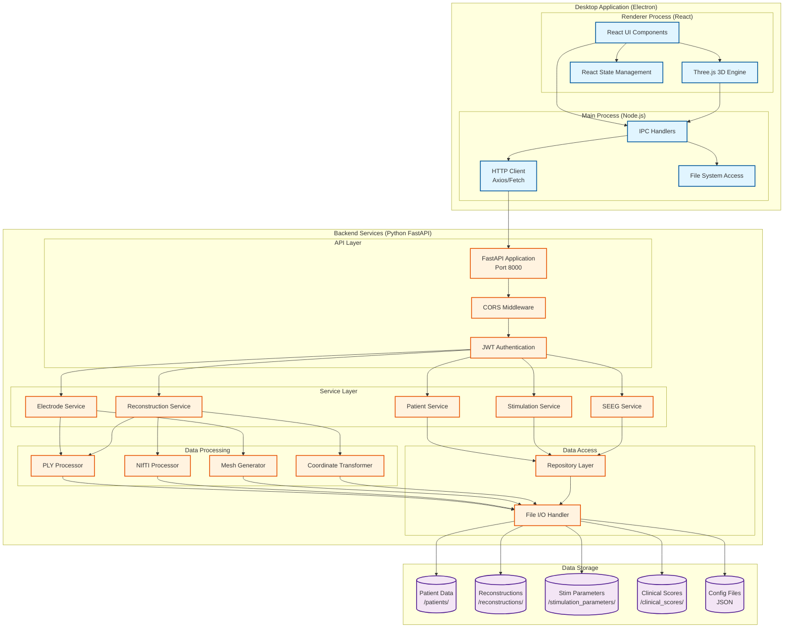
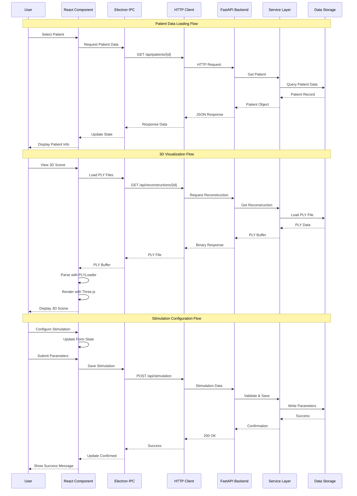
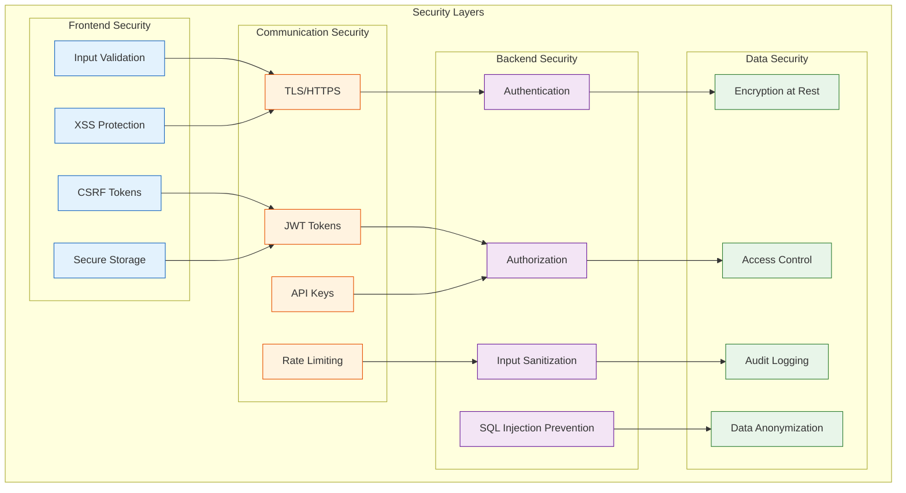
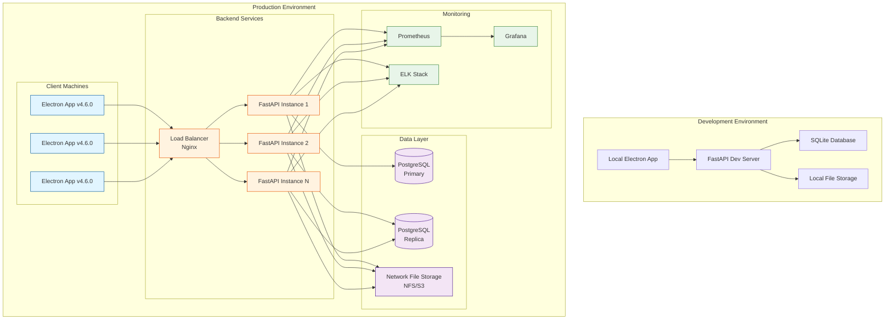
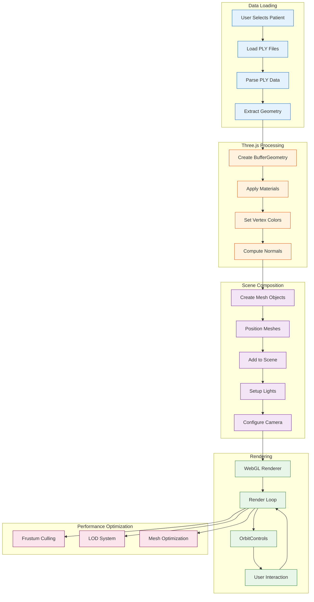

# Lead DBS Programmer - System Architecture

## Overview

Lead DBS Programmer is a comprehensive system designed to manage Deep Brain Stimulation (DBS) and Stereoelectroencephalography (SEEG) patient data, electrode configurations, and stimulation settings. The application uses an Electron-based frontend and a Python FastAPI backend.

## System Architecture Diagrams

### High-Level System Architecture

### Component Interaction Flow

### Data Flow Architecture

```mermaid
graph LR
    subgraph "Frontend Data Flow"
        A[User Input] --> B[React Component]
        B --> C[State Update]
        C --> D[IPC Handler]
        D --> E[HTTP Request]
    end
    
    subgraph "Backend Data Flow"
        E --> F[FastAPI Endpoint]
        F --> G[Pydantic Validation]
        G --> H[Service Layer]
        H --> I{Data Type}
    end
    
    subgraph "Processing Paths"
        I -->|PLY| J[PLY Processor]
        I -->|NIfTI| K[NIfTI Processor]
        I -->|JSON| L[Repository]
        I -->|Coordinates| M[Coord Transformer]
    end
    
    subgraph "Storage Layer"
        J --> N[(File System)]
        K --> N
        L --> O[(Database/JSON)]
        M --> N
    end
    
    subgraph "Response Flow"
        N --> P[Data Access Layer]
        O --> P
        P --> Q[Service Layer]
        Q --> R[API Response]
        R --> S[HTTP Response]
        S --> T[IPC Response]
        T --> U[React Update]
        U --> V[UI Render]
    end
    
    %% Styling
    classDef input fill:#e8f5e9,stroke:#2e7d32
    classDef process fill:#fff3e0,stroke:#e65100
    classDef storage fill:#f3e5f5,stroke:#4a148c
    classDef output fill:#e1f5ff,stroke:#01579b
    
    class A,B,C input
    class D,E,F,G,H,I,J,K,L,M process
    class N,O,P storage
    class Q,R,S,T,U,V output
```

### Security Architecture

### Deployment Architecture

### 3D Visualization Pipeline

---

## Technology Stack

### Frontend
- **Framework:** Electron (v12+)
- **UI Library:** React
- **3D Visualization:** Three.js
- **UI Components:** Material-UI (MUI)
- **Styling:** CSS, Bootstrap
- **State Management:** React Hooks (useState, useEffect)

### Backend
- **Framework:** Python FastAPI
- **Data Validation:** Pydantic
- **File Processing:** NumPy, SciPy
- **Medical Imaging:** Nibabel (NIfTI support)
- **3D Processing:** trimesh, open3d

### Data Formats
- **3D Models:** PLY (Polygon File Format)
- **Medical Imaging:** NIfTI (.nii, .nii.gz)
- **Data Storage:** JSON
- **Electrode Models:** Custom JSON configurations

## System Components

### Frontend Components

#### GroupViewer.js
- **Purpose:** Visualize multiple patient electrode configurations in 3D.
- **Highlights:** Three.js scene rendering, mesh controls, coordinate search.

#### PatientDatabase.js
- **Purpose:** Manage and filter patient data.
- **Highlights:** Listing, filtering, import/export.

#### SEEG.js
- **Purpose:** Configure SEEG stimulation.
- **Highlights:** Electrode/contact configuration, amplitude/pulse width.

#### StimulationSettings.js
- **Purpose:** Configure DBS stimulation parameters.
- **Highlights:** Contact and frequency settings.

#### PatientDetails.js
- **Purpose:** View individual patient data.
- **Highlights:** Demographics, configuration, history.

#### ClinicalScores.js
- **Purpose:** Manage clinical score data.
- **Highlights:** Entry, visualization, analysis.

### Backend Services

- **PatientService:** CRUD, filtering, validation
- **ElectrodeService:** Model/configuration management
- **StimulationService:** Parameter handling, validation, optimization
- **ReconstructionService:** 3D reconstruction, PLY generation
- **SEEGService:** SEEG data and processing
- **ClinicalScoreService:** Scores management, statistics

### Data Processing Services

- **PLYFileProcessor:** Parse/generate PLY, mesh optimization
- **NiftiProcessor:** Read/write NIfTI, voxel and coordinate processing
- **CoordinateTransformer:** System conversion, affine transforms
- **MeshGenerator:** 3D mesh operations and rendering

## Communication Flow

> **Unable to render flow diagram.**  
> Textual flow:
1. User performs action in UI (React Component)
2. UI communicates via Electron IPC handler
3. IPC sends request to HTTP client (Axios/Fetch)
4. HTTP client calls FastAPI endpoint
5. API invokes the Service Layer
6. Service interacts with Repository Layer
7. Repository accesses file system/data storage
8. Data (or response) passed back to UI

---

## Key Features

### 1. 3D Visualization
- Real-time rendering, overlays, camera, mesh/opacity controls

### 2. Patient Management
- Filterable database, multi-publication support, import/export

### 3. Stimulation Configuration
- DBS/SEEG settings, contact selection, optimization

### 4. Clinical Data Management
- Score tracking, statistics, reports

### 5. Electrode Management
- Multiple models, custom configurations, 3D visualization, contact params

## Data Flow

**Patient Data Flow**
1. Loaded from file system
2. Filtered in UI
3. Rendered in 3D
4. Electrode displays
5. Stimulation managed

**Stimulation Parameter Flow**
1. UI input/config
2. Validated by backend
3. Saved to file system
4. Visual updates
5. Outcomes tracked

**3D Visualization Flow**
1. PLY loaded
2. Parsed with PLYLoader
3. Three.js mesh creation
4. Scene composition
5. Rendered in UI

## Security Considerations

- **Data Privacy:** Patient data is stored locally
- **File Access:** Access restricted to application directory
- **API Security:** FastAPI configured with CORS
- **Validation:** Enforced at each application layer

## Performance Optimizations

- Mesh simplification/optimization
- Lazy-load UI components
- Data caching
- Efficient, conditional rendering

## Future Enhancements

- [ ] Database integration (e.g., PostgreSQL/MongoDB)
- [ ] Real-time collaboration
- [ ] Cloud storage
- [ ] Advanced analytics & ML
- [ ] Mobile support
- [ ] Enhanced visualizations
- [ ] Automated reporting
- [ ] DICOM viewer integration

## Contributing

We welcome contributions. Please consult our contributing guidelines and submit pull requests for improvements.

## License

See LICENSE file for details.

## Contact

For questions or support, open a GitHub issue.
